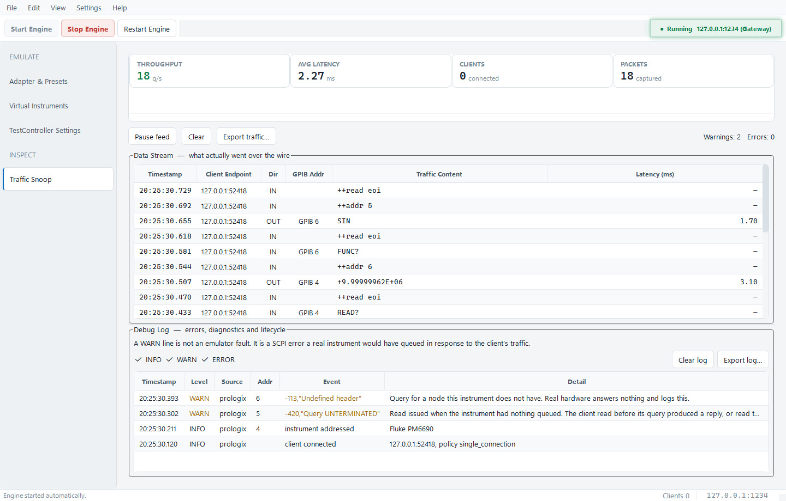

# ⚡ BenchForge Studio

> **Universal Bench Instrument & Gateway Emulator Suite**  
> *Zero-hardware test equipment simulation for PyVISA, SCPI, TestController, LabVIEW, and MATLAB test automation developers.*



---

## 📖 Overview

**BenchForge Studio** is a standalone, lightweight, multi-protocol bench instrument and hardware gateway emulator suite. It empowers lab automation engineers, driver developers, and test software authors to build, test, and validate instrument automation scripts **without needing physical test equipment or hardware adapters on their desk**.

---

## ✨ Key Capabilities

* **🌐 Multi-Protocol Gateway Emulation**:
  * **Prologix Ethernet (TCP 1234 — default)**: byte-identical to a physical GPIB-ETHERNET controller, firmware `01.06.06.00` — command set, CRLF framing, ESC escaping, case sensitivity, argument validation, serial poll, single-connection displacement.
  * **Keysight E5810A (VXI-11 / ONC-RPC, TCP 111 + 1024)**: a real VXI-11 gateway — RPC portmapper, core channel, interrupt/SRQ channel and the abort stub. Not a raw-socket stand-in.
  * **LXI SCPI Raw Socket (TCP 5025)** and **LXI mDNS Discovery (UDP 5353)**.
* **🔬 Instrument Personalities**: DMM, frequency counter, function generator and power supply, with vendor-correct reply formats — Keithley and Agilent disagree on how `FUNC?` spells DC volts, on whether integers carry a sign, and on whether a reading is a bare number or carries its elements. All reproduced from measurement.
* **🧾 SCPI Error Queue & Debug Log**:
  * Per-instrument error queue with `*ESR?` latching, raising `-113`, `-410` and `-420` from the same conditions real hardware does.
  * The Traffic page is split: the **Data Stream** shows what went over the wire, the **Debug Log** shows what it means. Both export.
* **🧪 Hardware Verification Toolchain** (`tools/`, [documented here](tools/README.md)):
  * `verify_offline.py` — 7 fidelity checks, no hardware, CI-safe.
  * `verify_hardware.py` — byte-for-byte diff against a physical Prologix.
  * `ab_instruments.py` — per-instrument A/B over either gateway.
  * `check_errors.py`, `capture_e5810.py`, `capture_e5810_channels.py`.
* **⚡ CI Validation Harness (`tests/run_validation_harness.py`)**: 12 protocol assertions plus a QPS stress mode.
* **📄 TestController Tooling**: parser for `Devices/*.txt` and generator for `settingsGPIB.txt` / `settingsLoad.txt`.

---

## 🔬 Empirical Hardware Profiles Included

Every behaviour BenchForge reproduces was measured against physical equipment.
Where something is inferred rather than measured, the profile says so.

| Profile | Hardware | Status |
| :--- | :--- | :--- |
| [`PROLOGIX_HARDWARE_PROFILE.md`](profiles/PROLOGIX_HARDWARE_PROFILE.md) | Prologix GPIB-ETHERNET, fw `01.06.06.00` | **measured** — 0 mismatches |
| [`E5810_HARDWARE_PROFILE.md`](profiles/E5810_HARDWARE_PROFILE.md) | Agilent E5810A LAN/GPIB Gateway | **measured** — VXI-11 wire behaviour |
| [`bus_capture.json`](profiles/bus_capture.json) | 7 instruments on the GPIB bus | **measured** — 86/86 replies |
| [`e5810_vxi11_capture.json`](profiles/e5810_vxi11_capture.json) | E5810A RPC-level capture | **measured** |
| [`e5810_channels_capture.json`](profiles/e5810_channels_capture.json) | abort / interrupt / docmd | **measured** |
| [`KEYSIGHT_34461A_LXI_PROFILE.md`](profiles/KEYSIGHT_34461A_LXI_PROFILE.md) | Keysight 34461A Truevolt DMM | measured |
| [`SIGLENT_SDM3065X_LXI_PROFILE.md`](profiles/SIGLENT_SDM3065X_LXI_PROFILE.md) | Siglent SDM3065X DMM | measured |
| [`AR488_ADAPTER_PROFILE.md`](profiles/AR488_ADAPTER_PROFILE.md) | AR488 / AR488Lan | ⚠️ **SOURCE-DERIVED — no hardware tested** |

> [!IMPORTANT]
> **Read [`docs/RELEASE_NOTES.md`](docs/RELEASE_NOTES.md) before filing a bug.**
> Three behaviours look like defects and are not — most importantly, TestController
> cannot connect to the E5810A persona, because a real E5810A refuses the device
> string it sends. Details and evidence in
> [`docs/TESTCONTROLLER_OBSERVATIONS.md`](docs/TESTCONTROLLER_OBSERVATIONS.md).

---

## 🚀 Getting Started

### Prerequisites
* Python 3.9+
* Windows 10 or 11 (the UI targets Segoe UI Variable and Cascadia Mono, with fallbacks)

### Installation
```bash
git clone https://github.com/Cyclotronic/BenchForge.git
cd BenchForge
pip install -r requirements.txt
```
*The emulator core is pure standard library. The only runtime dependency is **PySide6**, which provides the desktop UI.*

> [!NOTE]
> BenchForge uses **PySide6** (Qt for Python), licensed LGPL v3 and compatible with this project's MIT licence.
> Do not substitute PyQt6 — it is offered only under GPL v3 or a paid commercial licence, and linking it would force GPL on the entire application.

### Running Desktop GUI
```bash
python benchforge.py
```

### Running the Test Suite
```bash
python -m unittest discover -s tests
```
*24 tests covering the gateways, instrument models, DNS-SD behavior, GUI
construction, and packaging integration. They require no physical hardware.*

### Verifying Against Your Own Hardware
```bash
python tools/verify_offline.py                              # no hardware
python tools/verify_hardware.py   --host 192.168.1.80       # Prologix gateway
python tools/ab_instruments.py    --host 192.168.1.80       # instruments, Prologix
python tools/ab_instruments.py --gateway e5810 --host 192.168.1.85
python tools/check_errors.py      --host 192.168.1.80       # drain error queues
```
*These are read-only and safe on a live bench. See [`tools/README.md`](tools/README.md) — it documents the lessons that make them safe, including why reads are gated on MAV and why a bus scan reads each address three times.*

### Compiling Standalone Executable (`BenchForge.exe`)
```bash
pip install -r requirements-dev.txt
python build_exe.py
```
*(Produces the distributable application directory under `dist/BenchForge`.
Keep that entire directory together; `BenchForge.exe` is not a standalone
single-file build.)*

> [!TIP]
> **CI/CD Releases:** Every official release published on GitHub automatically
> triggers a GitHub-hosted Windows build. Static analysis, unit tests, offline
> fidelity checks, and a frozen-application smoke test must pass before the
> workflow attaches `BenchForge-Windows.zip` and its SHA-256 checksum.

Official downloads are published through
[GitHub Releases](https://github.com/Cyclotronic/BenchForge/releases). Release
binaries are currently **unsigned**, so Windows may display an Unknown
Publisher or Microsoft Defender SmartScreen warning. Compare the downloaded
ZIP with the `.sha256` file attached to the same release. See the
[Code Signing Policy](CODE_SIGNING_POLICY.md) for current status and the future
SignPath plan.

---

## Project Policies

* [Contributing](CONTRIBUTING.md) — development checks and pull-request guidance
* [Privacy](PRIVACY.md) — listeners, local discovery, and data handling
* [Security](SECURITY.md) — private vulnerability reporting
* [Code Signing Policy](CODE_SIGNING_POLICY.md) — release provenance and signing status
* [Third-party notices](LICENSES/THIRD_PARTY_NOTICES.md) — bundled dependency terms

BenchForge does not collect telemetry, analytics, or crash reports. Network
listeners and local mDNS advertisements operate only as part of emulator modes
started by the user.

---

## License

BenchForge source code is distributed under the [MIT License](LICENSE).
Binary distributions also include the applicable third-party license texts and
notices in the [`LICENSES`](LICENSES) directory.
